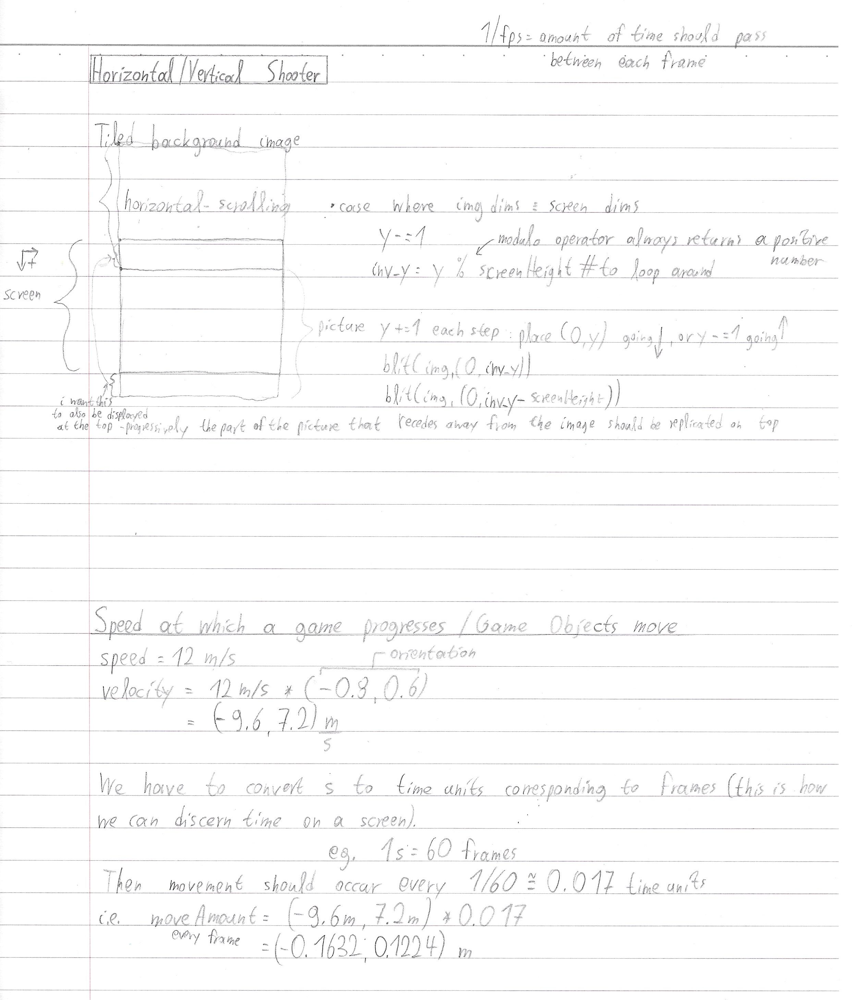

<h1 align="center">
	<a href="https://github.com/KeyC0de/AlienSpaceBattle">Alien Space Battle</a>
</h1>
<hr>

A 2d Space Invaders game clone.

I made this mostly for fun. To get more familiar with Python gaming I used PyGame module which hides all the down and dirty details and heads straight for the good stuff.

<p style="text-align: center;">
	
</p>

I used Python 3.6.6, PyGame 2.0.0, Visual Studio 2017, Windows 8.1 x86_64

# Usage

You can clone it, fork it, contribute to it, anything you want.

### File & Class Hierarchy

* images/ : directory for the texture images
* sounds/ : directory for the sounds
* alien.py : a `Bullet` class. The constructor takes a `Sprite` object and sets it up. Furthermore there are `blit()`ting facilities, `update()` which moves it around, `checkIfBottomIsReached()` tests if it has reached the bottom of the screen in which case tha player loses.
* bullet.py : a `Bullet` class. The constructor for configuration and blitting facilities. Also `update()` moves it around.
* button.py : a `Button` class. The constructor for configuration, represent it as a `pygame.Rect`angle. `drawButton()` and `prepareMessage()` facilities
* conf.ini : some configuration settings that persist through multiple runs. A sort of save system. The ini configuration read/store is handled by the excellent **[configobj](https://pypi.org/project/configobj/)** module
* game_functions.py : Contains all the game's functions. eg. `checkForEvents()`, `startGame()`, `gameOver()`, `updateBackgroundImage()`, `render()` everything on the screen, `fireBullet()`, `updateBullets()`, `checkBulletAlienCollision()` etc.
* game_stats.py : handles saving and loading to/from the conf.ini file
* main.py : Starts the game up. Creates `Settings`, the `Ship`, the bullets `Group()`ed, the Aliens `Group()`ed, the `Missile`s `Group()`ed, the `Stars` the `Scoreboard` the `Button`s. Then we enter the game loop and:
	1. `checkForEvents()` : Pops events from `pygame.event.get()` to check screen button presses, keyboard button presses, mouse button presses, window X close etc
	2. `updateShip()` : updates the ship (i.e. the player) appropriately given the user input
	3. `updateStars()` : updates star positions, creates more of them at random positions
	4. `updateBullets()` : updates positions for all bullets, checks collisions, removes bullets that tranverse beyond screen window boundaries
	5. `updateAliens()` : updates positions of all aliens, checks if they reached the bottom of the screen, checks collisions etc.
	6. `render()` : renders everything remaining on the screen
* missile.py : a `Missile` class. The constructor for configuration and blitting facilities. Also `updateMisilePosition()`
* scoreboard.py : a `Scoreboard` class updates the UI, the scoring, the highscore, the remaining ships count (i.e. the lives) etc.
* settings.py : a game `Settings` singleton class. Configures PyGame initialization stuff, lives, missiles, ships, points, stars, assets, sound, images and more
* ship.py : a `Ship` class. The constructor for configuration and blitting facilities.
* star.py : a `Star` class. The ctor configures its shape and appearance and a `drawStar()` function to `screen.blit()` it to the screen

Check code comments for more information.


### Horizontal / Vertical Scroller game mechanics

<p style="text-align: center;">
	
</p>


## cx_Freeze!

You can also use cxFreeze to build an executable out of your Python program. To do that create a setup.py file inside the project folder AlienSpaceBattle and fill it with required options. This was mine:

```
#! python
#coding=utf-8
#setup.py
import os
os.environ['TCL_LIBRARY'] = "C:/Program Files/Python36/tcl/tcl8.6"
os.environ['TK_LIBRARY'] = "C:/Program Files/Python36/tcl/tk8.6"
import cx_Freeze

executables = [cx_Freeze.Executable("main.py")]

cx_Freeze.setup(
    name = "python_invaders",
    version = "0.1",
    options={"build_exe": {"packages":["pygame"], 
                           "include_files":["images/2d-game-background-3.png","images/alien.bmp","images/alien_green.png", "images/alien_grey.png", "images/alien_nobg.tga", "images/alien_orange.png", "images/alien_purple.png", "images/destroyed_alien.png", "images/destroyed_green.png", "images/destroyed_ship.png", "images/missile.png", "images/missile_small.png", "images/raindrop.png", "images/ship.bmp", "images/ship_nobg.bmp", "images/ship_nobg.png", "images/space_background.jpg", "images/space_background.png", "images/star.png","sounds/bg_romariogrande__alien-dream.wav","sounds/fire_missile.ogg", "sounds/bg_romariogrande__alien-dream.ogg", "sounds/fire_missile.wav", "sounds/laser_bullet.wav", "sounds/laser_impact.ogg", "sounds/missile_hit.wav"]}},
    description = "Space Invaders in Python. Made with PyGame by Nikos Lazaridis",
    author = "KeyC0de",
    executables = executables
)
```

Then just run it. It will create a build folder with all the assets and the executable file called ``main.exe`.


### Controls

* P/lmb : start game
* Q : quit
* Arrow keys : move left, down, right, up
* SPACE : fire bolt
* ENTER : Fire missile


# Contribute

Please submit any bugs you find through GitHub repository 'Issues' page with details describing how to replicate the problem. If you liked it or you learned something new give it a star, clone it, contribute to it whatever. Enjoy.


# License

Distributed under the GNU GPL V3 License. See "GNU GPL license.txt" for more information.


# Contact

email: nik.lazkey@gmail.com</br>
website: www.keyc0de.net


# Acknowledgements

Sounds from Free Sounds.com</br>
Their names indicate the author. Some don't. And I don't remember their original names as this is a 3.5 year old project, but they were definitely on the public domain. If somebody's offended by this I can search my download history on FreeSounds.com to find their names and list them.</br>
Graphics mostly from me, except for the background space image which I snatched from Google public domain images. I don't remember exactly where I got them from.
